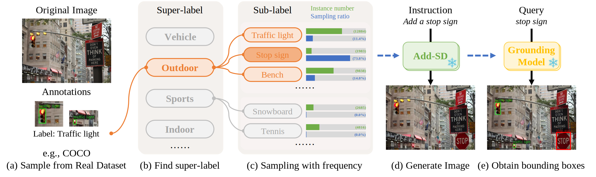

# Stage3. Generating synthetic data for downstream tasks

This stage generates synthetic data for downstream data augmentation. Annotations are update with 
[GroundingDINO](https://github.com/IDEA-Research/GroundingDINO).

## Pipeline

  
   
  We design a super-label-based sampling strategy to restrict the category of the added object, ensuring rationality. Then, we randomly sample a sub-label within the super-label, assigning a higher weight to tail-class labels to alleviate the long-tail problem. After image generation, the annotations are inherited from the vanilla dataset green for the original instance and grounded red for the added instance.

## Results

  
   
  Grounding results of synthetic data.

