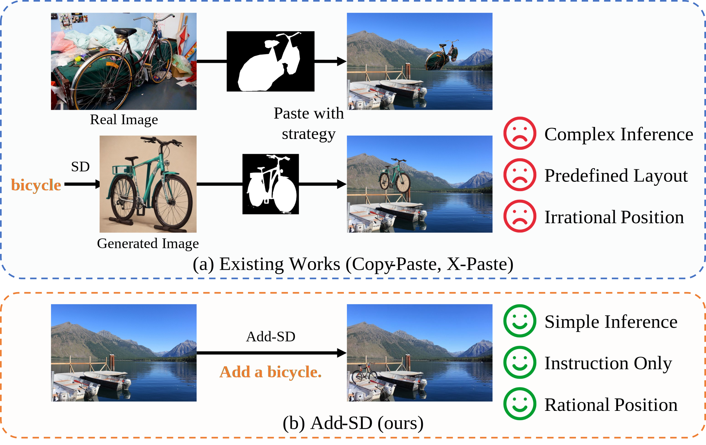

# Downstream tasks

We follow [XPaste](https://github.com/yoctta/XPaste) for most of the experimental settings to conduct object detection and instance segmentation tasks.

## Mehtod

  
   
  Compare with X-Paste.

## Results

#### Comparisons on LVIS.
| Method        | APbox | APrbox | APcbox | APfbox | APmask | APrmask | APcmask | APfmask |
| ------------- | ---------- | ------------ | ------------ | ------------ | ----------- | ------------- | ------------- | ------------- |
| Baseline      | 33.80      | 20.84        | 32.84        | 40.58        | 29.98       | 18.36         | 29.64         | **35.46**     |
| Copy-Paste    | 34.31      | 21.19        | **34.32**    | 40.07        | 30.29       | 19.97         | 30.43         | 34.67         |
| X-Paste       | 34.34      | 21.05        | 33.86        | **40.71**    | 30.18       | 18.77         | 30.11         | 35.28         |
| Add-SD (ours) | **34.82**  | **25.11**    | 33.90        | 40.11        | **30.87**   | **22.44**     | **30.44**     | 35.05         |

#### Comparisons on COCO.

| Method        | APbox | APmask |
| ------------- | ---------- | ----------- |
| Baseline      | 46.00      | 39.80       |
| Copy-Paste    | 46.40      | 39.80       |
| X-Paste       | 46.60      | 39.90       |
| Add-SD (ours) | **46.92**  | **40.50**   |
